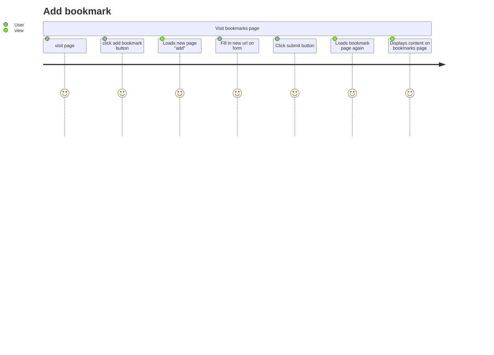

# Databases
---

## User Story
---
```
As a user
To be able to see my bookmarks
I'd like to see a list of my bookmarks
---
As a user
To be able to update my list of bookmarks
I'd like to create new bookmarks and add them to the list
```


------------------

## Database setup
1. Connect to psql
2. Create the database using the psql command CREATE DATABASE bookmark_manager;
3. Connect to the database using the pqsl command \c bookmark_manager;
4. Run the query we have saved in the file 01_create_bookmarks_table.sql
5. Run the query we have saved in the file 02_add_title_to_bookmarks.sql

* To view table do. SELECT * FROM bookmarks;

------------------

## testing environment setup
```
$> psql
admin=# CREATE DATABASE "bookmark_manager_test";
admin=# CREATE TABLE bookmarks(id SERIAL PRIMARY KEY, url VARCHAR(60));
```

https://github.com/makersacademy/course/blob/main/bookmark_manager/walkthroughs/09.md



